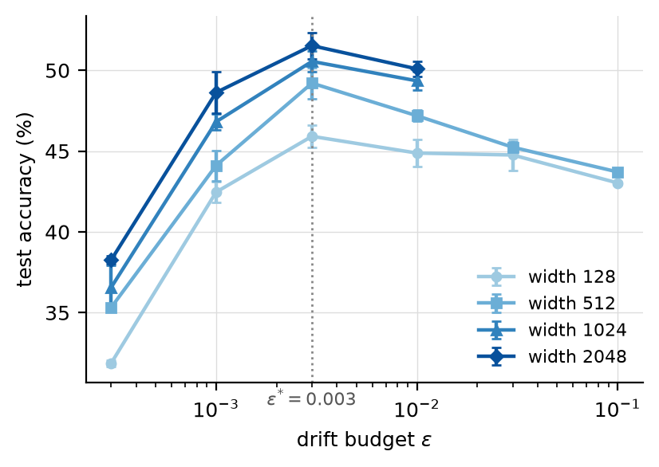
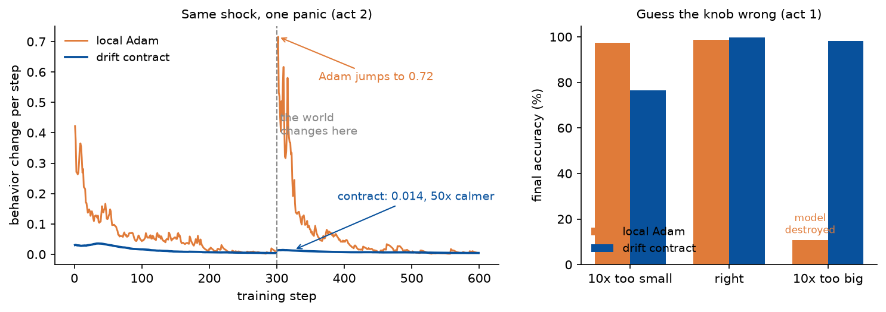

# The drift contract: spectral updates for local learning

Paper: `paper/paper.tex` (arXiv link to come). Every number below is reproducible from this repository; the core results rerun in about one hour on a laptop CPU.

**In plain terms.** Most neural networks learn from a report card that travels back through the whole network after every attempt, so every layer waits for it, and an engineer has to hand-tune how fast each network learns. Here, each layer grades itself and learns immediately. That idea is old, but it always broke down when networks got deep, until the update rule studied here: give every layer the same small "change budget" per step. With it, deep networks train fine, the one setting works unchanged on networks 16 times wider and 4 times deeper, and each layer's own updates are capped so they cannot change its behavior faster than the budget allows. Training that tunes itself and cannot lurch: that is what this repository measures.

Local learning (each layer trained by its own auxiliary loss, no global backward) is structurally parallel: layers update simultaneously without waiting for an end-to-end gradient. Historically it came with two costs: accuracy degrades with depth, and hyperparameters are fragile.

This repository shows that Muon-style spectral update geometry (momentum, Newton-Schulz orthogonalization, spectral step scaling), applied for the first time to per-layer local updates, removes both costs on our benchmark:

- One step-size setting (3e-3, expressed either as a fixed learning rate or as a per-layer activation drift budget) is optimal from width 128 to 2048 (16x) and from depth 12 to 48 (4x), with no re-tuning. Adam requires re-tuning along both axes.
- Depth stops killing local learning. At 48 layers, local Adam collapses to 32.0 percent even at its best learning rate. The spectral update reaches 42.1 percent with the same setting it uses at depth 12.
- At 5 seeds, width 512: drift contract 49.21 +/- 0.95 vs local Adam 46.75 +/- 0.85. The five-seed ranges do not overlap. The advantage grows with width and depth.

We also formulate the step size as a drift contract: with lr = epsilon / RMS(input), each layer's weight update changes its pre-activations by at most about epsilon (RMS) per step, conditioned on its current input (approximate orthogonalization and one contracting layer add stated slack; the paper gives the exact bound). The contract gives a small consistent gain over the best fixed learning rate (+0.6 to +1.5 points at every width), an interpretable knob, and a per-layer, input-conditioned drift bound that no standard optimizer provides (the paper states the bound and its conditions exactly).

## Honest attribution, established by pre-registered controls

- Width transfer of the step size is a property of the spectral geometry itself (the sqrt(d_out/d_in) scaling), not of the contract. The fixed-lr spectral update transfers too (control B).
- Depth robustness also belongs mostly to the geometry (the fixed-lr spectral update matches the contract at depth 24 and is 1.2 points behind at depth 48, within 2-seed noise).
- With RMSNorm and weight decay in the trunk, the stability advantage of spectral updates moves to global training (Muon), not local. The local advantage is largest exactly where normalization is absent. See `results/norm_sweep.json`.
- Width transfer of learning rates in local learning was previously shown for predictive coding and target propagation via muP parameterization (arXiv:2411.02001); our transfer covers auxiliary-head local learning, extends to depth, and derives the step from a drift bound.
- Grid selection in this version used the test split (all grid values are reported in full); a validation-split rerun is planned.
- Effective rank of features under spectral updates is 2 to 4x higher than under Adam, consistent with gradient-spectrum observations reported independently for global ViT training (arXiv:2605.24770).

<!-- FINALIZE: the two tables below use grid selection on the test split. When
cifar_val.json is complete, regenerate the validation-selected numbers with
`python analyze_val.py`, paste them here, and delete the test-split caveat above. -->
## Results overview

CIFAR-10 (20k train / 5k test, flattened), MLP depth 12, local linear heads, 12 epochs, mean test accuracy.

Width scaling, best setting per arm (contract keeps epsilon = 0.003 everywhere; Adam re-tuned per width):

| Width | Drift contract | Fixed-lr spectral | Local Adam | Gap contract vs Adam |
|---|---|---|---|---|
| 128  | 45.9 +/- 0.7 | 44.9 | 44.9 +/- 1.0 | +1.0 |
| 512  | 49.2 +/- 1.0 | 48.0 | 46.8 +/- 0.9 | +2.5 |
| 1024 | 50.6 +/- 0.6 | 49.0 | 47.8 +/- 0.8 | +2.7 |
| 2048 | 51.5 +/- 0.8 | 50.3 | 48.4 +/- 2.0 | +3.2 |

All contract and Adam cells are 5 seeds. The gap grows monotonically with width, and at widths 512 and 1024 the seed ranges of the two methods do not overlap.

Depth scaling at width 128 (contract keeps epsilon = 0.003; Adam re-tuned per depth):

| Depth | Drift contract | Local Adam |
|---|---|---|
| 12 | 45.9 | 44.9 |
| 24 | 45.4 | 41.3 |
| 48 | 42.1 | 32.0 |

Epsilon is a true interior optimum, identical at every width: accuracy collapses at epsilon = 0.0003 (underfitting), peaks at 0.003, and decays above, on both sides of the width range.



## Where this matters

The results point to settings where a global backward pass is impossible or unwanted. These are the settings the numbers support, not demonstrated deployments:

- Deep pipeline-parallel training on heterogeneous or unreliable nodes. Layers update from local losses only, so no backward traffic crosses node boundaries and no stage waits for downstream gradients. The depth result makes this viable beyond a dozen stages; the single setting removes per-node tuning, which does not survive contact with a fleet of changing machines. Concretely: train one model across four mismatched GPUs, or across machines that join and leave.
- On-device retraining. No backward pass means no stored activations, so training fits where inference fits. One epsilon ships with the model for the whole device fleet. Concretely: a keyboard model or a wake-word detector that adapts to its user on a low-end phone, during the day, without a cloud.
- Certifiable continual learning. The contract turns "the model retrains itself" from a monitored risk into a bounded one: each layer's own updates move its function by at most about epsilon per step. A system can be self-tuning and self-limiting at once, which is what retraining without a human in the loop requires. Concretely: a fraud or recommendation model that updates on live traffic while its operators can state, in writing, the maximum rate at which its behavior changes. Epsilon transfers across model scale but not across domains (0.01 on our synthetic task, 0.003 on CIFAR): calibrate once per domain on a small model, then never again as the system grows or retrains.
- Backprop-hostile hardware. The normalization result cuts both ways: spectral local updates matter most exactly where norm layers are absent, which is the situation of analog and neuromorphic substrates.

Not addressed here: forward-pass latency in distributed pipelines, and whether local losses carry enough signal at language-model scale. The second is the natural next question.

## Demo

Two minutes on a laptop CPU, NumPy only:

```bash
python demo.py
```

Two identical local-learning networks. Act 1 sets each method's only knob 10x too small, right, and 10x too big. Act 2 trains both live and, halfway through, hits every input with a fixed random rotation (an abrupt distribution shift). The demo narrates itself in the terminal and saves this picture at the end:



Same shock, same data, same architecture: Adam's behavior jumps to 0.72 while the contract never exceeds 0.014, and both end at the same accuracy. On the tuning side, a 10x-too-big knob destroys Adam's model (10.8 percent) and costs the contract almost nothing. Terminal output during act 2 looks like this:

```
  step  local Adam                        drift contract (eps=0.01)
   275  #                          0.006  #                          0.005
   300  #                          0.007  #                          0.004
          >>> input distribution shifts, next 8 steps shown one by one <<<
   302  ########################## 0.667  #                          0.013  <-- shock
   303  ########################## 0.716  #                          0.013  <-- shock
   304  ########################## 0.533  #                          0.014  <-- shock
   305  ########################## 0.519  #                          0.014  <-- shock
   325  ###################        0.192  #                          0.013
   350  ########                   0.082  #                          0.010
----------------------------------------------------------------------------
                           max drift after shock  final acc (shifted data)
local Adam                                 0.716                     99.3%
drift contract                             0.014                     99.3%
```

There is an optional third act for the depth claim. It trains a 48-layer network three ways (contract with its depth-12 setting, Adam re-tuned for depth 48, Adam with its depth-12 setting transferred) and compares against the paper's numbers. It needs `cifar_data.npz` and about 10 minutes on CPU, or 6 with cupy installed:

```bash
python demo.py --depth
```

Both networks end at the same accuracy. The difference is the path: Adam gets there through a behavioral jump 50 times larger than the contract ever allows. For a model that retrains in production, the path is the product.

## Repository layout

| File | Purpose |
|---|---|
| `drift_contract.py` | Everything: data, Newton-Schulz, optimizers, model, training loop, metrics. Pure NumPy, optional CuPy backend (`DRIFT_GPU=1`). |
| `demo.py` | The distribution-shift demo above. |
| `convert_cifar.py` | Builds `cifar_data.npz` from the HuggingFace cifar10 parquet files. |
| `runner4_fair.py` | Stability sweep, no normalization, equal auxiliary treatment (fixes a confound in an earlier protocol). |
| `runner5_norm.py` | Same sweep with RMSNorm and weight decay. |
| `runner7_bias.py` | Bias contract ablation (frozen / normalized momentum / clipped Adam). |
| `runner8_cifar.py`, `runner9_bracket.py`, `runner10_gpu.py` | CIFAR width transfer and epsilon bracketing. |
| `runner11_gpu.py` | Main campaign: fixed-lr control, widths 1024/2048, depths 24/48, seeds. |
| `runner12_gpu.py` | Depth control (the fixed-lr spectral update at depth) and remaining seeds. |
| `runner13_gpu.py` | Validation-based campaign: selection on a held-out split, width and depth confirmation, seed statistics, variants. Resumes from `cifar_val.json`. |
| `analyze_val.py` | Turns `cifar_val.json` into the paper tables by validation-based selection. |
| `results/` | Raw JSON output of every run. |
| `paper/` | Draft manuscript. |

## Reproduce

CPU only, no framework:

```bash
python -m venv .venv && .venv/bin/pip install numpy
# synthetic experiments (about 1 hour on a laptop CPU)
.venv/bin/python runner4_fair.py
.venv/bin/python runner5_norm.py
.venv/bin/python runner7_bias.py
# CIFAR experiments need the dataset first
.venv/bin/pip install pyarrow pillow
curl -sL -o hf_train.parquet https://huggingface.co/datasets/uoft-cs/cifar10/resolve/main/plain_text/train-00000-of-00001.parquet
curl -sL -o hf_test.parquet https://huggingface.co/datasets/uoft-cs/cifar10/resolve/main/plain_text/test-00000-of-00001.parquet
.venv/bin/python convert_cifar.py
.venv/bin/python runner8_cifar.py
```

GPU (optional, any CUDA 12 card):

```bash
.venv/bin/pip install cupy-cuda12x
DRIFT_GPU=1 .venv/bin/python runner11_gpu.py
```

Every runner checkpoints to JSON after each run and can be interrupted and relaunched.

## Method in four lines

For each layer l with local loss L_l, input h, gradient G = dL_l/dW_l:

```
m   = 0.95 m + G                          momentum
O   = newton_schulz5(m)                   orthogonalize: all singular values to 1
lr  = epsilon / rms_ema(h)                drift contract (or a fixed lr)
W  -= lr * sqrt(max(1, d_out/d_in)) * O   spectral-scaled step
```

Bias updates use Adam clipped to RMS epsilon. Auxiliary heads stay under Adam.

## Limitations

MLP classifiers only, 12 fixed epochs, CIFAR-10 subset, linear local heads. Per-layer drift is bounded but total network drift still grows with depth (0.20 at depth 12 to 0.55 at depth 48 for the same epsilon). Newton-Schulz adds roughly 10 to 15 percent compute overhead at these sizes.

## License

MIT

## Star history

[](https://star-history.com/#infinition/drift-contract&Date)
